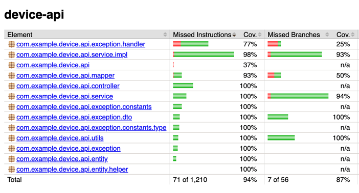

# 📱 Device API

REST API for managing device resources (create, update, query, delete). Implements full CRUD, domain validation rules, persistence on PostgreSQL, OpenAPI documentation, Docker containerization, and component tests using Testcontainers.

---
## 🌐 Public Deployment

A live version of the API is deployed at **116.203.139.249:8080**.

- **Swagger UI:** http://116.203.139.249:8080/swagger-ui/index.html
- You can interact using Swagger UI, Postman, or `curl`.

---

## 🔧 Tech Stack

- Java **21**
- Spring Boot **3**
- PostgreSQL **15**
- Liquibase
- Docker / Docker Compose
- Testcontainers
- MapStruct
- Maven
- JaCoCo
- OpenAPI/Swagger

---

## ✅ Features

### CRUD Operations
- Create a device
- Fully update (PUT)
- Partially update (PATCH)
- Fetch device by ID
- Fetch devices with filters & pagination
- Fetch device by brand + name
- Delete device

### Domain Rules
- `createdAt` cannot be modified
- Devices in state `IN_USE`:
    - cannot change name/brand
    - cannot be deleted
- Brand + name must be unique → returns `409 CONFLICT`
- Unified validation & error response format

---

## 📦 Prerequisites

- **JDK 21**
- **Maven 3.9+**
- Docker Desktop (optional, for local DB)
- IntelliJ IDEA or any IDE

---

## 🚀 Running the Project Locally

Choose one of the options below.

### Option 1 — Full Local Environment (Recommended)

1. **Clone the repository**
   ```sh
   git clone https://github.com/MRXPROG/device-api.git
   cd device-api
   ```
2. **Start PostgreSQL using Docker Compose**
   ```sh
   docker compose up -d
   ```
   PostgreSQL runs with:

   | Property  | Value     |
      |-----------|-----------|
   | Host      | localhost |
   | Port      | 5433      |
   | Database  | device_db |
   | Username  | postgres  |
   | Password  | postgres  |

3. **(Optional) Use your own database**
   Create `src/main/resources/application-local.yaml`:
   ```yaml
   spring:
     datasource:
       url: jdbc:postgresql://localhost:5433/device_db
       username: postgres
       password: postgres
   ```
   `application-local.yaml` is ignored by Git.

4. **Build the project**
- Recommended: Make it by plugin Maven in IDEA
   ```sh
   mvn clean install
   ```

### ⚠️ Java & Maven Compatibility

The project uses **Java 21**. Running Maven with Java 23/25 may cause:

```
Fatal error compiling: com.sun.tools.javac.code.TypeTag :: UNKNOWN
```


#### Check your Maven Java

```sh
mvn -version
```

If Java is not 21, switch it. Examples:

**macOS (Homebrew)**
```sh
brew install openjdk@21
export JAVA_HOME=$(/usr/libexec/java_home -v21)
export PATH="$JAVA_HOME/bin:$PATH"
```

---
5. **Run the application**
   ```sh
   mvn spring-boot:run -Dspring-boot.run.profiles=local
   ```
   
* Recommended: Go to the [ServerStartUp.java](src/main/java/com/example/device/api/ServerStartUp.java) and the run application
---
6. **Open Swagger UI**
    - http://localhost:8080/swagger-ui/index.html

### Option 2 — Use the Public Deployment

- **Swagger UI:** http://116.203.139.249:8080/swagger-ui/index.html
- Tools: Swagger UI, Postman, `curl`

Example `curl` request:
```sh
curl -X POST http://116.203.139.249:8080/device-api/devices \
  -H "Content-Type: application/json" \
  -d '{"name":"iPhone 14", "brand":"Apple", "state":"AVAILABLE"}'
```

---

## 🧪 Tests

- Unit tests
- Component tests with Testcontainers
- JaCoCo coverage

Run tests:

Recommended: In your IDEA, but also by terminal:
```sh
mvn test
```

Generate coverage report:
```sh
mvn jacoco:report
```
Report path: `target/site/jacoco/index.html`



---

## 🧱 Database Migrations (Liquibase)

Liquibase runs automatically on startup. Changes are tracked in `DATABASECHANGELOG`.

---

## 🌐 API Overview

### Query

| Method | Endpoint                  | Description                |
|--------|---------------------------|----------------------------|
| GET    | `/device-api/{id}`        | Fetch device by ID         |
| GET    | `/device-api/devices`     | Filters + pagination       |
| GET    | `/device-api/search`      | Fetch by brand + name      |

### Command

| Method | Endpoint             | Description        |
|--------|----------------------|--------------------|
| PUT    | `/device-api/{id}`   | Full update        |
| PATCH  | `/device-api/{id}`   | Partial update     |

### Create

| Method | Endpoint                   |
|--------|----------------------------|
| POST   | `/device-api/devices`      |

### Delete

| Method | Endpoint             |
|--------|----------------------|
| DELETE | `/device-api/{id}`   |

---

## 📘 Unified Error Model

All errors follow the structure below:

```json
{
  "timestamp": "2025-11-23T10:31:45",
  "httpStatus": "BAD_REQUEST",
  "errorCode": "INVALID_REQUEST",
  "errorMessage": "Name must not be blank",
  "errorType": "VALIDATION_ERROR"
}
```

---

## 🛡 Validation Rules

- `name` ≥ 3 characters
- `brand` ≥ 3 characters
- Allowed characters: `A-Za-z0-9 _-`
- `state` must be a valid enum
- `createdAt` cannot change
- Cannot update name/brand if `IN_USE`
- Cannot delete if `IN_USE`
- `brand` + `name` must be unique → `409 CONFLICT`

---


## 🚀 Future Improvements (Extended & Production-Ready)
### 🔐 Security & Access Control

- Implement Authentication & Authorization (JWT, OAuth2, Keycloak)
### 🏗 Architecture & Code Quality

- Add Checkstyle code formatting

- Add SonarQube for static analysis (bugs, smells, coverage)

- Introduce @Cacheable caching for query endpoints

- Use Projections in QueryService for better performance
(e.g., interface-based Spring Data projections)


### 🧪 Testing & QA

- Add Karate Integration Tests (full end-to-end)

- Add Testcontainers Reuse Mode to speed up tests

### 📊 Observability

- Add Prometheus metrics (Micrometer)

- Add Grafana dashboards (API performance, DB latency)

- Add Distributed Tracing (Jaeger / OpenTelemetry)

- Add structured logging (JSON logs for ELK stack)

- Log ID for tracing requests across systems

### 📦 Deployment & DevOps

- Add GitHub Actions CI/CD pipelines
(build → test → sonar → docker → deploy)

- Add Docker image versioning & security scanning (Snyk/Trivy)

### 🗄 Database & Performance

- DB indexing improvements (composite indexes for filters)

- Implement caching layer (Redis)

- Add soft-delete instead of hard delete

- Add DB migrations test (Liquibase rollback testing)

- Enable query logging & analyzing slow queries

### 🧩 Features & API Enhancements

- Add device history / audit log

- Add HATEOAS links for navigation

- Add advanced filtering (date ranges, createdAt, etc.)

### 🔒 Data Integrity & Domain Enhancements

- Add optimistic locking for concurrent changes
